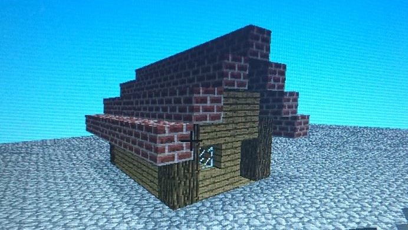
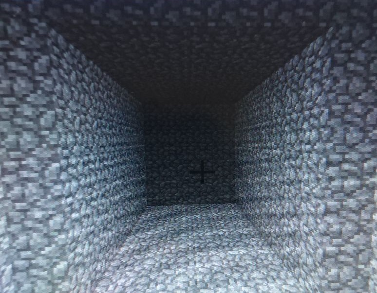
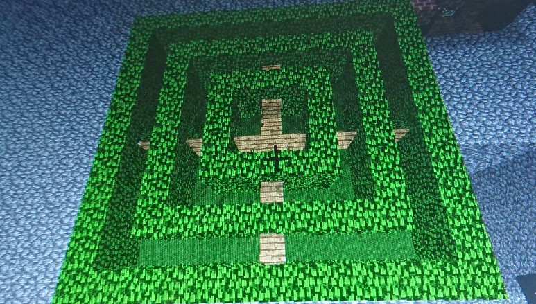

# LEGO bricks

# French

Notre projet consiste en un programme qui reproduit une construction en **LEGO** dans le logiciel *Minecraft*, Pour cela, il photographie la structure depuis le haut. La caméra utilisée est la caméra V2 de la **Raspberry Pi**. Le programme est écrit en python. Nous utilisons la librairie *OpenCV* pour interpréter les images prises par la caméra

## Tutoriel

Pour le fonctionnement du logiciel, il faut suivre certaines instructions: 
1) Il faut construire couche par couche, c’est à dire qu’il faut commencer par le sol, puis couche par couche atteindre le sommet
2) Une fois la couche finie, il faut appuyer sur le bouton pour que le logiciel construise la couche sur *Minecraft*
3) Il ne faut pas superposer des briques de même couleurs l’une sur l’autre

C’est un projet que nous faisons pour le cours d’informatique de notre gymnase.

# English

Our project is a prgram that recreates a **LEGO** creation inside minecraft. For that, it takes pictures of the structure from the top. We use the V2 camera of the **Raspberry Pi**. The program is written in python. We're using the *OpenCV* Library to get the image taken with the camera and interpret it.

## Tutorial

To use the program, there are steps to follow :
1) The structure in LEGO must be built layer by layer. Starting from the bottom to the top.
2) After a layer is done, the user must press the button to inform the program it's done.
3) Bricks with the same color shouldn't be place on top of each other.

This is a project we're making for highschool as students.

# Generating Functions

We've create 5 files to generate things in minecraft :

## House
The function `house(length, height, width, wallBlock, secondaryWall, groundBlock, roofBlock)` create a house at the player's current position with the given arguments :
- length : the length of the house
- height : the height of the house (Without the roof)
- width : the width of the house
- secondaryWall : The wall borders (pillars)
- wallBlock : The block used to make the wall
- groundBlock : The block used to make the ground
- roofBlock : The block used to make the roof)

## Tunnel 
The function `tunnel(width, height, length, angle)` create a tunnel at the player's current position in the given direction :
- width : The width of the tunnel (from the center to the side)
- height : The height of the tunnel
- length : The length of the tunnel
- angle : The direction

## Garden
The file `Garden.py` generte a garden like this one :
	

## MondePlat
The file `MondePlat.py` clear the minecraft world to get a flat map.

## Mur
The file `Mur.py` generates a wall all around the player.
