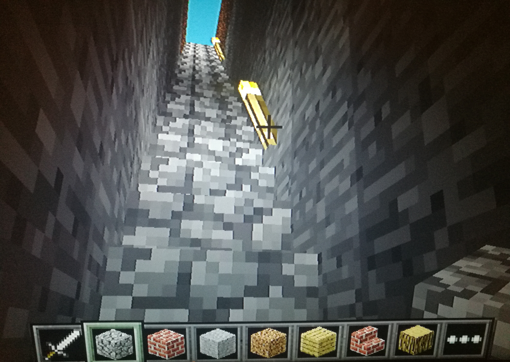
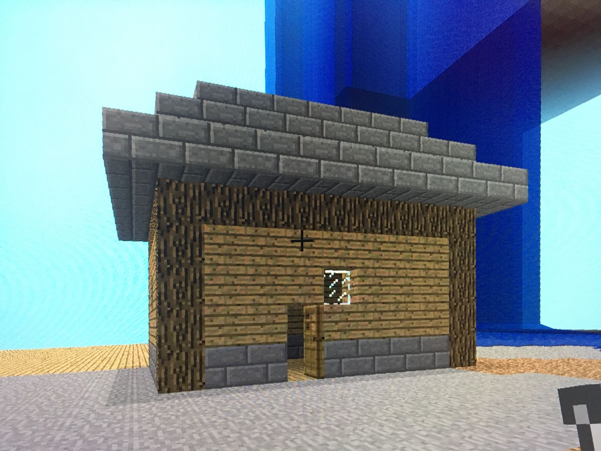

# Magic wand
by Albert Guedj and Ludovic Blanc

## Question you propably think about

*What does it do ?*

It creates different structures in minecraft-pi

*How does it work ?*

when the wand with a metal piece touches another piece of metal on the box it calls a function depending which piece we touched

*Are the functions always similar ?*

No there is button on the magic wand to select options for the functions

*What function exists ?*

For now there is a function creating a mine and another transforming block around the player like King Midas.

*What do I do if I've got an idea of function ?*

You can write to us and it can probably help us to have other ideas!!

## Explaination of functions
### Midas.py 
Midas takes every blocks except air one and transforms them into Gold.

### Mine.py 
Mine make a mine in front of the player.

### House.py
House makes an House...

