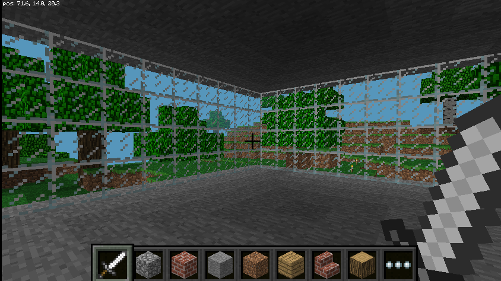
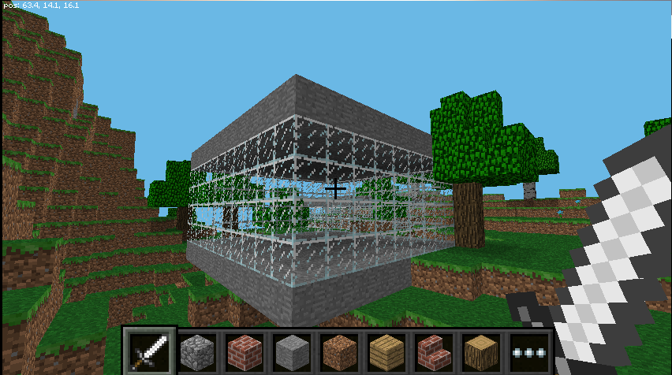
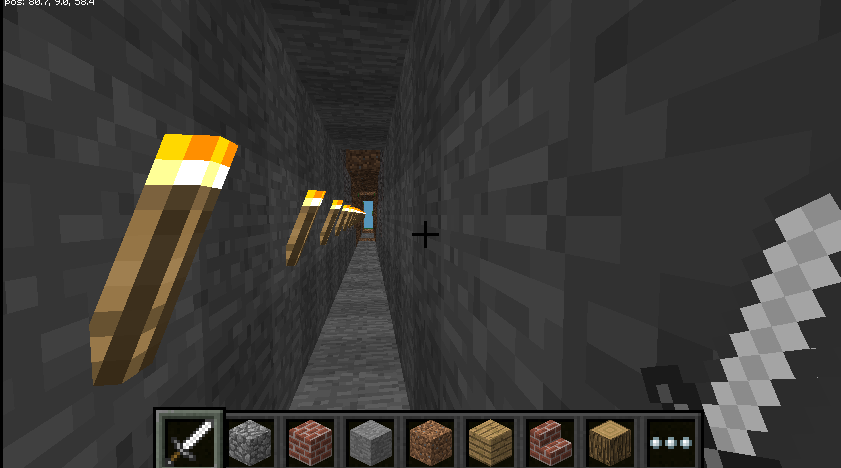
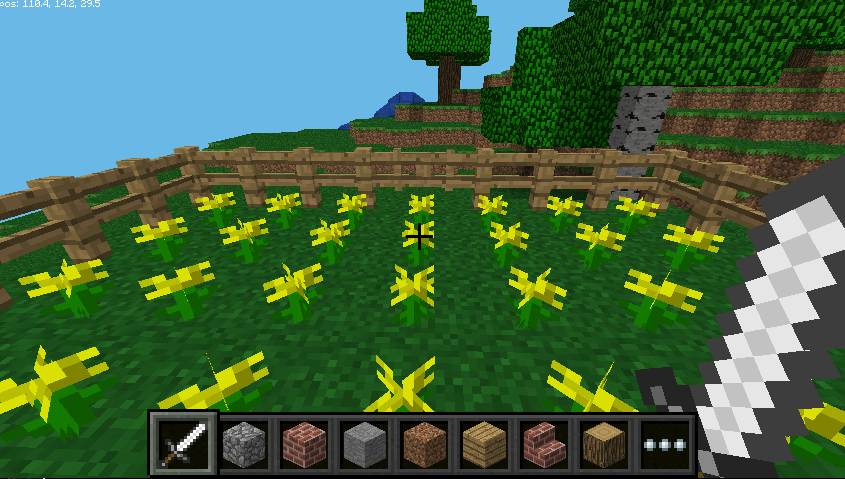

# Sense HAT

Source : [Getting started with the Sense HAT](https://projects.raspberrypi.org/en/projects/getting-started-with-the-sense-hat/)

Install the software with `sudo apt-get install sense-hat`

The file `minecraft_build.py` uses the Sense HAT joystick to select among four structures
 to create within Minecraft (tunnel, house, garden, snow).

## House
The function `house(d=5, h=4)` creates a house with a stone floor, glass walls and a stone ceiling.

This is the house seen from the outside.

## Tunnel
The function `tunnel(d=20)` creates a tunnel lined with torches in the direction of the last player movement.

## Garden
The function `garden(d=4)` creates a fenced garden with grass on the ground and yellow flowers.

